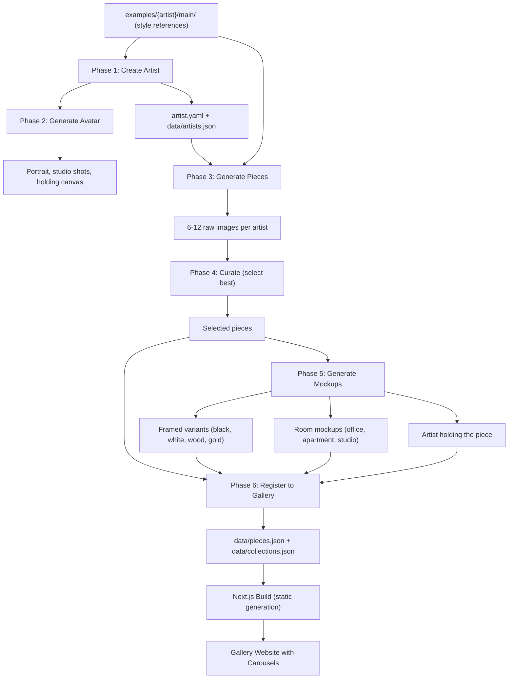
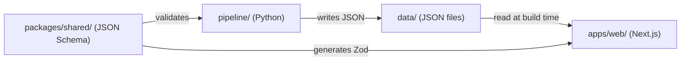

# Noir Canvas v2 -- Foundation & Rules Setup

## Project Location

Create `c:\b2\noir-canv-v2\` as the new project root. The old repo at `c:\b2\noir-canv\` stays untouched for reference and cherry-picking.

## Monorepo Folder Structure

```
noir-canv-v2/
├── .cursor/
│   └── rules/                    # Cursor rules (see below)
├── .github/
│   └── workflows/                # CI pipeline (placeholder)
├── apps/
│   └── web/                      # Next.js 16 App Router
│       ├── app/                  # Routes, layouts, pages
│       │   ├── (marketing)/      # Route group: home, about
│       │   ├── artists/
│       │   │   └── [slug]/
│       │   ├── piece/
│       │   │   └── [slug]/
│       │   ├── collections/
│       │   │   └── [slug]/
│       │   ├── journal/
│       │   └── api/              # API route handlers
│       ├── components/
│       │   ├── gallery/          # PieceCard, ArtistCard, etc.
│       │   └── layout/           # Navigation, Footer
│       ├── lib/
│       │   ├── data.ts           # Single data access layer
│       │   ├── schemas.ts        # Zod schemas (generated from shared)
│       │   └── utils.ts
│       ├── public/
│       ├── e2e/                  # Playwright E2E tests
│       ├── next.config.ts
│       ├── vitest.config.ts
│       └── package.json
├── pipeline/                     # Python AI pipeline
│   ├── src/
│   │   └── pipeline/
│   │       ├── commands/         # Click CLI commands
│   │       ├── lib/              # Config, paths, prompts, schemas
│   │       ├── api/              # FastAPI app
│   │       └── scripts/          # Batch/download utilities
│   ├── content/
│   │   └── artists/              # YAML artist configs
│   ├── tests/                    # pytest tests
│   ├── pyproject.toml
│   └── requirements.txt
├── packages/
│   └── shared/                   # Cross-language contracts
│       ├── schemas/
│       │   ├── artist.schema.json
│       │   ├── piece.schema.json
│       │   └── collection.schema.json
│       └── package.json
├── data/                         # Pipeline output (JSON, read by frontend)
│   ├── artists.json
│   ├── pieces.json
│   └── collections.json
├── turbo.json
├── package.json                  # Root workspace config
├── pnpm-workspace.yaml
├── .gitignore
├── .env.example
└── AGENTS.md                     # Root-level agent instructions
```

## Product Concept

Noir Canvas is a premium limited-edition art gallery that uses AI to create "virtual artists." The core loop:

1. Start with real artist style references in `examples/{artist-name}/main/`
2. Generate a virtual artist persona (pseudonym, bio, statement, influences)
3. Generate a photorealistic artist portrait and studio photos
4. Generate 6-12 original art pieces inspired by the style references but with new subjects
5. Generate mockups: framed variants, room settings (office, apartment, studio), artist holding the piece
6. Publish everything to the gallery website with browsable carousels

All image generation uses the Google Gemini API as the primary backend (with SDXL/FLUX as fallbacks for specific use cases like avatars).



### Pipeline Phases (detailed)

**Phase 1: Create Artist** (`pipeline create-artist`)
- Input: an `examples/{name}/main/` folder with 5-20 style reference images
- Generates: pseudonym, slug, bio, artist statement, style description, influences
- Outputs: `pipeline/content/artists/{slug}.yaml` (generation config) and entry in `data/artists.json` (gallery display)
- Bio/statement generation uses Gemini text API for quality prose
- The YAML config contains generation parameters (model, steps, cfg_scale, prompt prefix/suffix)
- The JSON entry contains display fields (name, bio, statement, portrait, influences, style, pricingTier)

**Phase 2: Generate Artist Media** (`pipeline avatar`, `pipeline artist-studio`)
- Portrait: photorealistic headshot for profile page
- Studio shots: artist at easel working, artist in creative space
- Holding canvas: artist presenting a finished piece (composited later with real piece)
- All outputs go to `data/` or `apps/web/public/images/artists/{slug}/`

**Phase 3: Generate Pieces** (`pipeline generate`)
- Uses style references from `examples/` + artist config to generate 6-12 images per artist
- Gemini API is the primary generation backend (configured via `gemini_model` in artist YAML)
- Prompts built from: piece description + artist prompt_prefix + style_reference + prompt_suffix
- Pipeline analyzes the style references to determine typical subjects (landscapes, portraits, abstracts, etc.) and generates new subjects in the same vein
- Outputs to `pipeline/output/raw/{artist-slug}/{piece-slug}/`

**Phase 4: Curate** (`pipeline curate`)
- Interactive or programmatic selection of best images from each batch
- Selected images move to `pipeline/output/selected/{artist-slug}/`
- Optional upscale step for print resolution

**Phase 5: Generate Mockups** (`pipeline mockup`)
- Frame variants: black frame, white frame, natural wood, gold, unframed
- Room settings: modern apartment living room, home office, creative studio, minimalist gallery wall
- Artist holding piece: composite of artist portrait + framed piece
- Each piece gets 4-6 mockup variants
- Outputs to `pipeline/output/mockups/{framed,rooms}/`

**Phase 6: Register to Gallery** (`pipeline register`)
- Writes piece metadata to `data/pieces.json` (validated against shared JSON Schema)
- Updates `data/collections.json` with new pieces in appropriate collections
- Copies final images to `apps/web/public/images/pieces/`, `apps/web/public/images/mockups/`
- Triggers Next.js rebuild (or ISR invalidation) to publish

### Key v1 Pipeline Assets to Port

The existing pipeline at `c:\b2\noir-canv\pipeline\` already implements most phases:
- `commands/create_artist.py` -- Phase 1 (pseudonym gen, YAML config creation)
- `commands/generate.py` -- Phase 3 (SDXL, FLUX, and Gemini generation)
- `commands/avatar.py` -- Phase 2 (Realistic Vision V6 for portraits)
- `commands/artist_studio.py` -- Phase 2 (working/holding studio mockups)
- `commands/curate.py` -- Phase 4 (interactive curation)
- `commands/frame.py` -- Phase 5 (PIL + perspective transform framing)
- `commands/room_mockup.py` -- Phase 5 (room wall compositing with lighting transfer)
- `commands/mockup.py` -- Phase 5 (orchestrator for frame + room)
- `commands/upscale.py` -- Phase 4 (Real-ESRGAN upscaling)
- `lib/prompts.py` -- prompt building logic
- `lib/config.py` -- artist/piece loading from YAML/JSON
- `lib/paths.py` -- path constants
- `lib/comfyui_client.py` -- ComfyUI integration

All of these are portable. The main changes needed:
- Cross-platform paths (no hardcoded `/`)
- Outputs write to `data/` JSON instead of rewriting TypeScript source
- Registration phase writes JSON, not string-manipulated `.ts` files
- Auth and background tasks on FastAPI endpoints

## Cursor Rules (`.cursor/rules/`)

Each rule file uses MDC format (`.mdc`) with frontmatter specifying when the rule applies.

### 1. `architecture.mdc` -- Monorepo Structure Enforcement

Enforces the `apps/` + `packages/` + `pipeline/` layout. Prevents:
- Files at root that belong in `apps/web/`
- Python code outside `pipeline/`
- Shared types defined in only one language
- Direct imports between `apps/web/` and `pipeline/`
- Standalone scripts that aren't integrated into a framework (Next.js build or Click CLI)

Specifies that data flows one direction:



### 2. `nextjs-app-router.mdc` -- Next.js 16 Best Practices

Glob: `apps/web/**/*.{ts,tsx}`

Rules:
- Pages and layouts are Server Components by default -- never add `"use client"` to a page
- Extract interactive parts to separate client component files at the leaf level
- Use `generateStaticParams` for all `[slug]` routes
- Use `next/image` with `sizes`, `priority`, and `placeholder="blur"` -- never native ``
- `notFound()` only in Server Components, never in `"use client"` files
- No `document.getElementById` -- use `useRef` or controlled components
- No `use(params)` pattern -- use `async function Page({ params })` with `await params`
- Route Handlers only for external consumers/webhooks, not for internal data fetching
- Server Actions for mutations
- `suppressHydrationWarning` requires a comment explaining why

### 3. `data-contracts.mdc` -- Schema & Data Layer

Glob: `packages/shared/**`, `data/**`, `apps/web/lib/data*`, `apps/web/lib/schemas*`

Rules:
- Single source of truth: JSON Schema files in `packages/shared/schemas/`
- Python validates with Pydantic models generated from JSON Schema
- TypeScript validates with Zod schemas generated from JSON Schema
- All data in `data/` directory as JSON files, never hardcoded TypeScript arrays
- Zod parse at build time -- if pipeline outputs invalid data, the build fails
- No denormalized fields (no `artistName` on pieces -- join from artists at read time)
- Piece IDs use UUID or `{artistSlug}-{sequential}` format (no ambiguous initials)
- Never rewrite TypeScript source code programmatically

### 4. `components.mdc` -- React Component Standards

Glob: `apps/web/components/**/*.tsx`

Rules:
- One component per file, named export matching filename
- Props interface defined in the same file (not in a central types file unless shared by 3+ components)
- No component file exceeds 200 lines -- split into subcomponents
- Accessibility: all images have descriptive `alt`, all interactive elements are keyboard-accessible
- No inline styles -- use Tailwind classes
- Currency values use `Intl.NumberFormat` with locale
- Mobile-first responsive design -- every component must work at 320px width

### 5. `python-pipeline.mdc` -- Pipeline Best Practices

Glob: `pipeline/**/*.py`

Rules:
- All commands registered in the Click CLI group -- no standalone script files
- Pydantic `BaseModel` with `model_config = ConfigDict(extra="forbid")` for all data models
- No inline imports -- all imports at module top
- FastAPI endpoints must not block on long-running work -- use background tasks or a queue
- No arbitrary filesystem paths from user input -- validate and sandbox all paths
- CORS origins from environment variables, never hardcoded
- All API endpoints require authentication for mutations
- Type hints on all function signatures
- Cross-platform paths: use `pathlib.Path`, never string concatenation with `/`

### 6. `testing.mdc` -- Test Requirements

Glob: `**/*.test.{ts,tsx}`, `**/*.spec.{ts,tsx}`, `**/tests/**/*.py`, `**/e2e/**/*.ts`

Rules:
- Frontend: Vitest + React Testing Library for unit tests, Playwright for E2E
- Python: pytest for unit and integration tests
- Every new component needs a co-located test file (`Component.test.tsx`)
- Every new Python command needs a test in `pipeline/tests/`
- Data validation: test that `data/*.json` passes Zod schemas
- No mocking of data -- use fixture files
- E2E tests cover: homepage loads, artist page renders, piece page renders, collection page renders, 404 on invalid slug
- Test files follow `describe/it` pattern with clear test names

### 7. `ci-cd.mdc` -- CI/CD Pipeline

Glob: `.github/**/*.yml`

Rules:
- CI runs on every push and PR
- Stages (in order): lint, typecheck, test, build
- Lint: ESLint + Biome for TypeScript, Ruff for Python
- Typecheck: `tsc --noEmit` for TypeScript, `pyright` for Python
- Test: Vitest (frontend), pytest (pipeline)
- Build: `pnpm turbo run build`
- Schema drift check: regenerate schemas, `git diff --exit-code packages/shared/`
- E2E runs on main branch merges only (Playwright against preview)
- No secrets in CI config -- use GitHub Actions secrets

### 8. `security.mdc` -- Security Rules

Glob: `**/*.{ts,tsx,py}`

Rules:
- No `execSync` or `exec` in API route handlers
- No open proxies -- validate and allowlist target URLs
- No arbitrary filesystem paths from request input
- API mutations require authentication
- Environment variables for all secrets, URLs, and configuration
- `.env` files never committed -- only `.env.example` templates
- CORS from environment variables
- No `allow_methods=["*"]` or `allow_headers=["*"]` in production CORS

### 9. `imports.mdc` -- Import Organization

Glob: `**/*.{ts,tsx}`

Rules:
- All imports at the top of the file, never inline/dynamic imports inside functions (except `next/dynamic` for code splitting)
- Import order: external packages, then `@/` aliases, then relative imports
- Use `@/` path alias (maps to `apps/web/`)
- No circular imports between data modules

### 10. `git-hygiene.mdc` -- Repository Standards

Rules:
- `.gitignore` must include: `node_modules/`, `.next/`, `venv/`, `__pycache__/`, `.env`, `*.pyc`, `pipeline/output/`, `comfyui/`
- Never commit virtual environments, build artifacts, or binary blobs
- Commit messages follow conventional commits (`feat:`, `fix:`, `chore:`, `docs:`)
- No files over 500 lines (split data files, split components)

### 11. `product-concept.mdc` -- Product Vision & Pipeline Phases

Always-on rule (no glob -- applies to all files). Documents the core product loop so every agent understands what Noir Canvas is and how the pieces fit together:

- The product creates "virtual artists" from real style references
- Six pipeline phases: Create Artist -> Generate Media -> Generate Pieces -> Curate -> Generate Mockups -> Register to Gallery
- Gemini API is the primary image generation backend
- All pipeline output flows through `data/*.json` files validated against shared JSON Schema
- The gallery website statically renders all content at build time
- Each artist has: profile page, portrait, studio shots, 6-12 pieces, mockup variants
- Each piece has: framed variants (4 styles), room mockups (3-4 settings), artist-holding composite
- Never generate standalone scripts -- every pipeline operation is a Click CLI command
- The `examples/` folder is the creative seed -- it contains real art that inspires but is never displayed publicly
- Generated art must be original subjects in the style of the references, not copies

### 12. `gallery-ux.mdc` -- Gallery UI & Interaction Patterns

Glob: `apps/web/components/**/*.tsx`, `apps/web/app/**/*.tsx`

Rules:
- Piece detail pages show a carousel of mockup variants (framed, room settings, artist holding)
- Carousel uses keyboard navigation (arrow keys), swipe on mobile, dot indicators
- Image lightbox for full-screen viewing with zoom
- Artist profile pages show: portrait, bio, statement, studio shots, and a grid of their pieces
- Collection pages show themed groupings with piece cards
- Piece cards show: image, title, artist name, edition progress (e.g. "8 of 15 sold"), starting price
- Edition badge: visual indicator of scarcity (sold out = "Sold Out" badge, <3 remaining = "Almost Gone")
- Frame selector: interactive component to toggle between frame styles on piece detail page
- Room mockup viewer: carousel or tab interface showing the piece in different room settings
- All interactive gallery components (carousel, lightbox, frame selector) are client components extracted from server component pages
- Lazy load images below the fold; `priority` on hero and first 3 cards only

## Root `AGENTS.md`

Instructions for AI agents working on the repo:

- Describes the monorepo structure and how the three domains (web, pipeline, shared) interact
- Lists the data flow: pipeline writes JSON -> shared schemas validate -> web reads at build time
- Specifies that agents must never create standalone scripts outside the framework
- References each `.cursor/rules/*.mdc` file by name and purpose
- Lists specialized subagent roles (see below)

## Specialized Subagent Roles

Documented in `AGENTS.md` for delegation during development. Each role has a defined scope, the rules it must follow, and what it must never touch.

### Infrastructure Agents

- **schema-author**: Works in `packages/shared/schemas/`. Defines JSON Schema files for Artist, Piece, Collection, Mockup. Generates Zod schemas for TypeScript and Pydantic models for Python. Runs drift checks. Must follow `data-contracts.mdc`. Never writes application code.

- **ci-builder**: Works in `.github/workflows/`. Sets up GitHub Actions for lint, typecheck, test, build, schema drift detection, and E2E. Must follow `ci-cd.mdc`. Never modifies application code.

- **test-writer**: Works in `apps/web/**/*.test.tsx`, `apps/web/e2e/`, and `pipeline/tests/`. Adds Vitest, Playwright, and pytest tests. Must follow `testing.mdc`. Never modifies the code under test -- only adds test files.

### Frontend Agents

- **frontend-builder**: Works in `apps/web/app/` and `apps/web/components/`. Builds Server Component pages, layouts, and extracted client component islands. Must follow `nextjs-app-router.mdc`, `components.mdc`, and `gallery-ux.mdc`. Uses data from `apps/web/lib/data.ts` only -- never reads pipeline output directly.

- **design-porter**: Ports visual design from v1 (`c:\b2\noir-canv\src\`). Extracts Tailwind theme tokens, typography (Inter + Playfair Display), color palette, component markup. Adapts to Server Component patterns. Must follow `components.mdc`.

- **gallery-interaction-builder**: Builds interactive client components: image carousel, lightbox, frame selector, room mockup viewer, edition progress badge. Must follow `gallery-ux.mdc` and `components.mdc`. Each component is a separate `"use client"` file under `apps/web/components/gallery/`.

### Data Agents

- **data-migrator**: Extracts valuable content from `c:\b2\noir-canv\src\lib\data\` into `data/*.json`. Cleans placeholder descriptions, fixes ID collisions, removes denormalized `artistName` fields, validates against shared JSON Schema. Only the ~50 hand-written pieces with real descriptions are ported -- the 97 "Pipeline selection" placeholders are discarded. Must follow `data-contracts.mdc`.

### Pipeline Agents

- **pipeline-porter**: Ports Python pipeline code from `c:\b2\noir-canv\pipeline\` to `pipeline/src/pipeline/`. Restructures into proper package layout. Fixes cross-platform paths, removes inline imports, adds type hints. Must follow `python-pipeline.mdc`. Key files to port: `commands/create_artist.py`, `commands/generate.py`, `commands/avatar.py`, `commands/artist_studio.py`, `commands/curate.py`, `commands/frame.py`, `commands/room_mockup.py`, `commands/mockup.py`, `commands/upscale.py`, `lib/config.py`, `lib/paths.py`, `lib/prompts.py`, `lib/schemas.py`, `lib/comfyui_client.py`.

- **pipeline-phase-runner**: Orchestrates the full artist creation pipeline (Phase 1-6). Understands the end-to-end flow documented in `product-concept.mdc`. Can run individual phases or the full sequence. Validates output at each phase boundary using shared schemas.

- **api-builder**: Works in `pipeline/src/pipeline/api/`. Ports FastAPI endpoints with proper auth, background tasks (no blocking on GPU inference), input validation (no arbitrary filesystem paths), and env-based CORS. Must follow `python-pipeline.mdc` and `security.mdc`. Generates OpenAPI spec for TypeScript client generation.

### Quality Agents

- **code-reviewer**: Runs hostile review against all `.cursor/rules/*.mdc` files. Checks for architecture drift, standalone scripts, schema inconsistencies, security issues, missing tests. Reports findings with severity levels.

- **security-auditor**: Checks for SSRF, path traversal, missing auth, hardcoded secrets, open CORS, execSync in handlers. Must follow `security.mdc`. Scans both TypeScript and Python.

## What Gets Created (File Count)

- 12 `.cursor/rules/*.mdc` files (architecture, nextjs, data-contracts, components, python-pipeline, testing, ci-cd, security, imports, git-hygiene, product-concept, gallery-ux)
- 1 `AGENTS.md` root file (with 12 subagent role definitions)
- 1 `.gitignore`
- 1 `.env.example`
- Skeleton `package.json`, `pnpm-workspace.yaml`, `turbo.json` (workspace config only, no app code)
- Empty directory structure with `.gitkeep` files where needed

Total: ~22 files, all configuration/documentation. No application code yet -- that comes after the foundation is confirmed.
